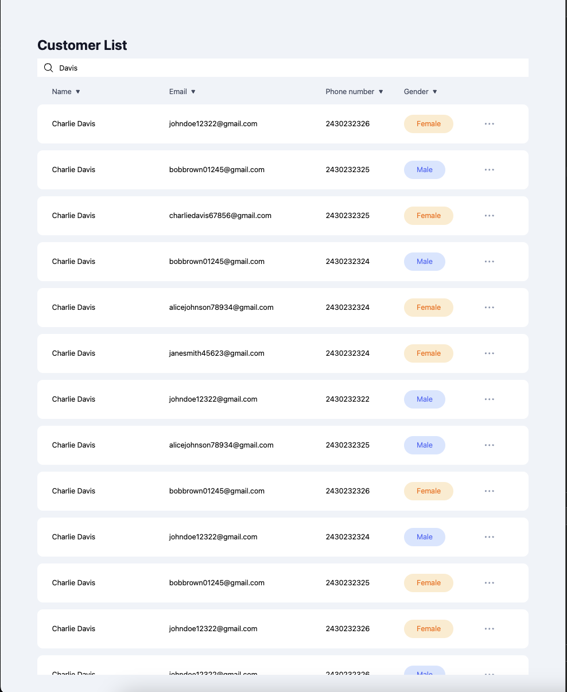

# Next JS users administration dashboard

Used list virtualizacion with react-window to improve performance in large list of data

## Demo:



## To run locally

First, run the development server:

```bash
npm run dev
# or
yarn dev
# or
pnpm dev
# or
bun dev
```

Open [http://localhost:3000](http://localhost:3000) with your browser to see the result.
